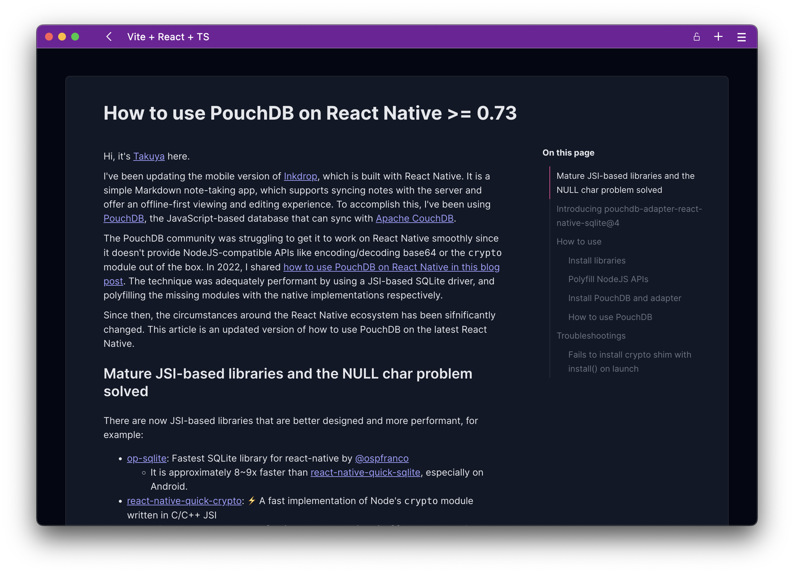

# live-note-preview

Public, read-only web viewer for a single Obsidian note. It renders a published
note at a stable URL (`https://obsidian.loonielabs.net/r/<slug>`) with a smoothly-animated, scroll-synced table of contents.

This is the viewer half of a two-part system. The
[**Duckuments LiveSync**](https://github.com/duckuments/duckuments-live-sync)
Obsidian plugin publishes a note (its **Copy public link** command), and this
app renders it. The plugin does the writing; this repo only reads.



## How it works

1. In Obsidian, the Duckuments LiveSync plugin's **Copy public link** command
   writes a `pub:<slug>` document — the note's **plaintext** markdown and title —
   to CouchDB, and copies the `/r/<slug>` URL.
2. Opening `/r/<slug>` loads the SPA, which calls `GET /api/note/<slug>`.
3. The backend resolver (`server/index.ts`) reads `pub:<slug>` from CouchDB and
   returns `{ markdown, title }`. CouchDB credentials never reach the browser.
4. The SPA renders the markdown (remark → rehype → React) with a live table of
   contents that highlights the section you're reading.

> ⚠️ **Published snapshots are plaintext and public.** Unlike the plugin's
> encrypted sync, a `pub:<slug>` snapshot is stored unencrypted so the viewer
> can read it without a passphrase. The slug is unguessable but the page is not
> access-controlled — anyone with the link can read the note.

## Stack

- [React](https://react.dev/) 18 + [Vite](https://vitejs.dev/) SPA
- [`kuma-ui`](https://www.kuma-ui.com/) for UI, [`framer-motion`](https://www.framer.com/motion/) for the TOC animation, [`zustand`](https://zustand-demo.pmnd.rs/) for state
- [`unified`](https://unifiedjs.com/) / remark / rehype for markdown rendering
- Backend: plain [Node.js](https://nodejs.org/) (>=22, runs TypeScript directly), no framework
- Storage: [CouchDB](https://couchdb.apache.org/)
- [pnpm](https://pnpm.io/) for package management

## Run locally

```bash
pnpm install

# Terminal 1 — backend resolver (reads CouchDB, serves /api/note/<slug>)
cp server/.env.example server/.env   # then fill in your CouchDB details
pnpm serve                           # node server/index.ts, listens on :8787

# Terminal 2 — frontend dev server
pnpm dev                             # Vite on :5173, proxies /api -> :8787
```

Open a published note at `http://localhost:5173/r/<slug>`.

Resolver self-check (no network): `pnpm check` (`node server/index.ts --check`).

## Configuration

The backend reads these env vars (see `server/.env.example`):

| Variable           | Default                 | Purpose                        |
| ------------------ | ----------------------- | ------------------------------ |
| `COUCHDB_URL`      | `http://localhost:5984` | CouchDB base URL               |
| `COUCHDB_DB`       | `obsidiannotes`         | Database holding `pub:` docs   |
| `COUCHDB_USER`     | _(empty)_               | CouchDB user (blank = no auth) |
| `COUCHDB_PASSWORD` | _(empty)_               | CouchDB password               |
| `PORT`             | `8787`                  | Resolver listen port           |

Slugs are restricted to `[A-Za-z0-9_-]{1,128}` since they map straight to a
CouchDB doc id (`pub:<slug>`).

## Scripts

| Command        | What it does                                |
| -------------- | ------------------------------------------- |
| `pnpm dev`     | Vite dev server (proxies `/api` to `:8787`) |
| `pnpm serve`   | Run the backend resolver                    |
| `pnpm check`   | Resolver self-check, no network             |
| `pnpm build`   | Typecheck + production build                |
| `pnpm preview` | Preview the production build                |
| `pnpm lint`    | ESLint                                      |

## Deployment

Production runs under pm2 (`ecosystem.config.cjs`): `obsidian-note-api` (the
resolver, reading `.env.local`) and `obsidian-note-web` (`vite preview` on
`127.0.0.1:4173`). On push to `main`, GitHub Actions
(`.github/workflows/deploy.yml`) lints + builds, then SSH-deploys: `git pull`,
`pnpm install`, `pnpm build`, `pm2 restart`.

## Credits

The animated table-of-contents rendering is based on
["How to build a smoothly animated table of contents"](https://www.devas.life/how-to-build-a-smoothly-animated-table-of-contents-with-framer-motion-and-kuma-ui/)
and its [video tutorial](https://youtu.be/4g26x6FzuBU).

## License

MIT
